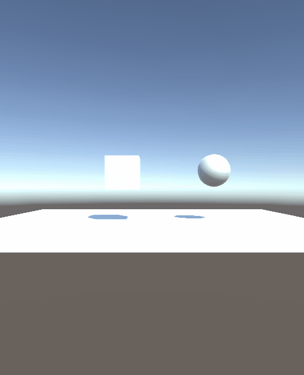
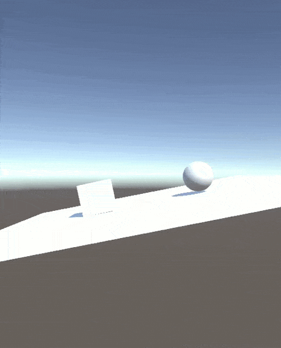
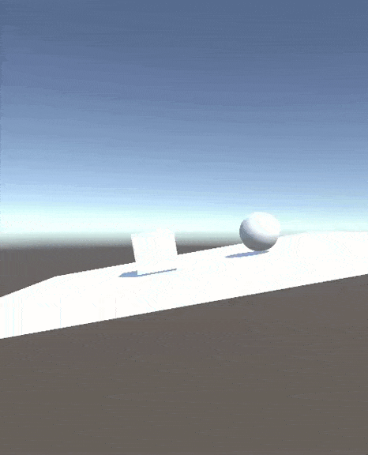
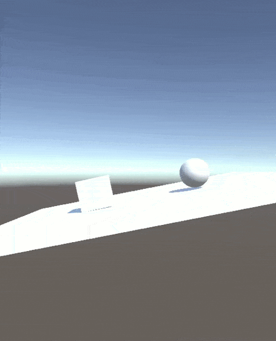
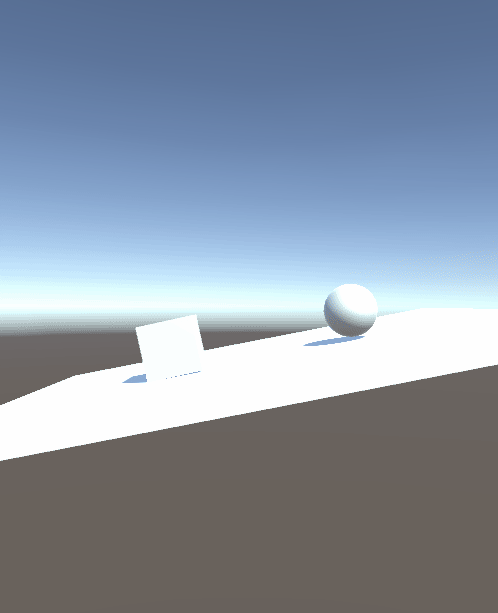
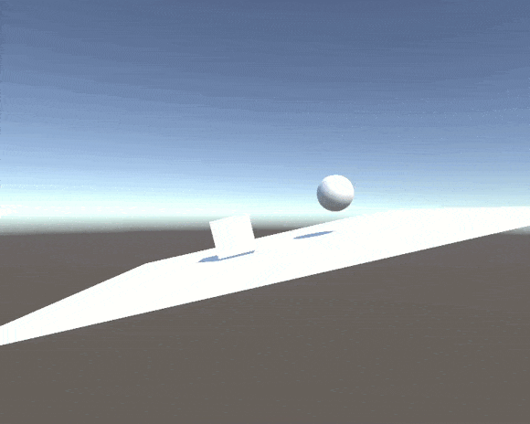
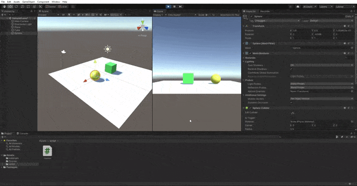

# Práctica 2: Introducción a los scripts en Unity

- Autor: Adal Díaz Fariña
- Contacto: alu0101112251@ull.edu.es

1 Crear una escena simple sobre la que probar diferentes configuraciones de objetos físicos en Unity. La escena debe tener un plano a modo de suelo, una esfera y un cubo.

  a. Ninguno de los objetos será físico.

  Al ningún objeto ser físico como podemos ver en el gif no se moverán. Esto es debido a que al no tener un rigidbody no le afectarán las físicas como la gravedad.

  

  b. La esfera tiene físicas, el cubo no.

  En este ejemplo podemos ver como el cubo sigue sin tener físicas por lo que no tiene ningún movimiento mientras que la esfera al tener un rigidbody se ve afectada por la gravedad y como tiene una masa tiende a caer

  

  c. La esfera y el cubo tienen físicas.

  En esto otro ejemplo ya los dos elementos tienen sus rigidbody por lo que se ven afectado por las físicas y tiende a caer

  

  d. La esfera y el cubo son físicos y la esfera tienen 10 veces la masa del cubo.

  Para este ejemplo vamos a ver como afecta la colisión de la esfera con el cubo. Es decir, cuanto lo desplaza.

  - Si la esfera como el cubo tuvieran la misma masa este sería el desplazamiento tras la colisión

  

  - Podemos observar en este gif que al tener la esfera 10 veces mas de masa, desplaza el cubo una mayor distancia

  

  e. La esfera tiene físicas y el cubo es de tipo IsTrigger.

  En este ejemplo, la esfera tiene físicas por lo que tiende a caer y rotar, pero el cubo no tiene físicas por lo que no se mueve y además al activarle la opción IsTrigger no detecta la colisión de la esfera por lo que la esfera traspasa el cubo.

  

  f. La esfera tiene físicas y el cubo es de tipo IsTrigger y tiene físicas.

  En este otro ejemplo, el cubo sigue teniendo activa la opción IsTrigger por lo que no detecta las colisiones pero además ahora tiene un rigidbody por lo que le afectan las físicas. Al afectarles las físicas tiende a caer pero como no detecta las colisiones traspasa el plano.

  

  g. La esfera y el cubo son físicos y la esfera tiene 10 veces la masa del cubo, se impide la rotación del cubo sobre el plano XZ 

  Este ejemplo es el mismo que el del apartado d pero bloqueando dos ejes. Lo que pasa que al bloquear los ejes ya no tenemos una vibración al chocar con el elemento.

  

  En este gif podemos ver como no podemos mover los ejes x z solo y

  

